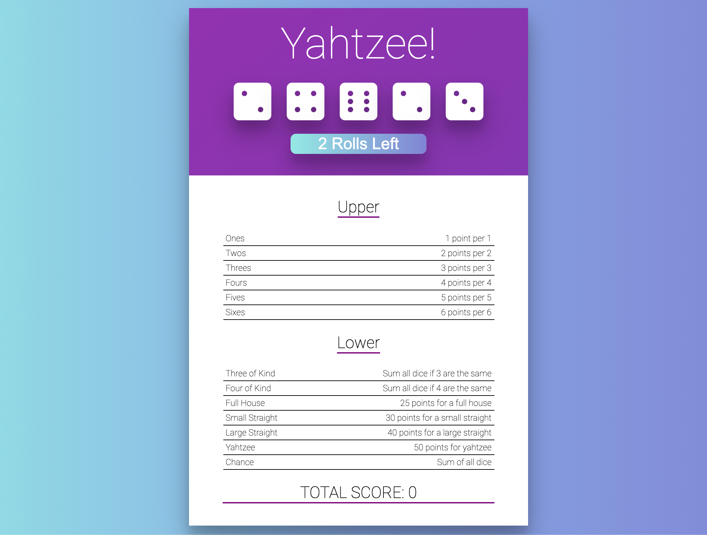

# Yahtzee Game

### About the game

Yahtzee is a chance-and-strategy dice rolling game. A game is played over 13 rounds.

Each round, the player rolls five 6-sided dice. They may click on any number of dice to “freeze” or “unfreeze” them (frozen dice are displayed in a different color). They may re-roll the unfrozen dice up to 2 times.

Each round, they must assign their dice to any unclaimed scoring category. Each category scores differently.

After 13 rounds, the game is over, and the player’s score is the total of each scoring category.

[More about the rules](https://en.wikipedia.org/wiki/Yahtzee)

### Description

This project aims to fix some problems from a starter code of a Yahtzee game.

The tasks to complete are the following:

1- Fix clicking dice: click dice to toggle whether or not they’re going to be re-rolled

2- Add missing rules: complete the evaluation rules for
  - a full house:  3 of one die and 2 of another should always score 25
  - a small straight: four dice in a row (1-2-3-4 or 2-3-4-5, for example) should always score 30

3- Prevent rolling more than 3 times

4- Disallow re-using a score line

5- Add descriptions:
  - one for each rule to explain how it’s scored and display it before the user clicks on a rule
  - once the user clicks a row, hide the description and instead display the score value

6- Add icons: rewrite the code to use font-awesome die icons

7- Animate the dice:
  - make the dice shake or spin when they are being rolled
  - make the dice unclickable while the animation is going on

8- Show the total score

It displays an interface that looks like this:

React-specific optionals:

- Prevent assigning the same dice to more than one score line
- Make the game start with the dice already rolled
- Add code to detect when the game is over, and add a “play again?” feature that resets the game
- Use an add-on library for “styled components” to move CSS out of .css files and into component definitions

Non-React-specific optionals:

- Improve the style and the dice animation
- Add a new scoring category for dice that would not match any of the other rules
- Use localStorage to keep track of this highest score so that it is displayed below the scoring area.
- Implement more complex scoring [rules](https://en.wikipedia.org/wiki/Yahtzee#Yahtzee_bonuses_and_Joker_rules)

### Technologies

*Languages:* Javascript, HTML, CSS

*Library:* React

### Key features

* Roll dice maximum twice

* Select dice not to be rolled

* Display description for each rule

* Hide description and display score when a rule is clicked

* Display the total score

### Poject status

The project is just started.

### Credits & Sources

* Another small project from [The Modern React Bootcamp](https://www.udemy.com/course/modern-react-bootcamp)
